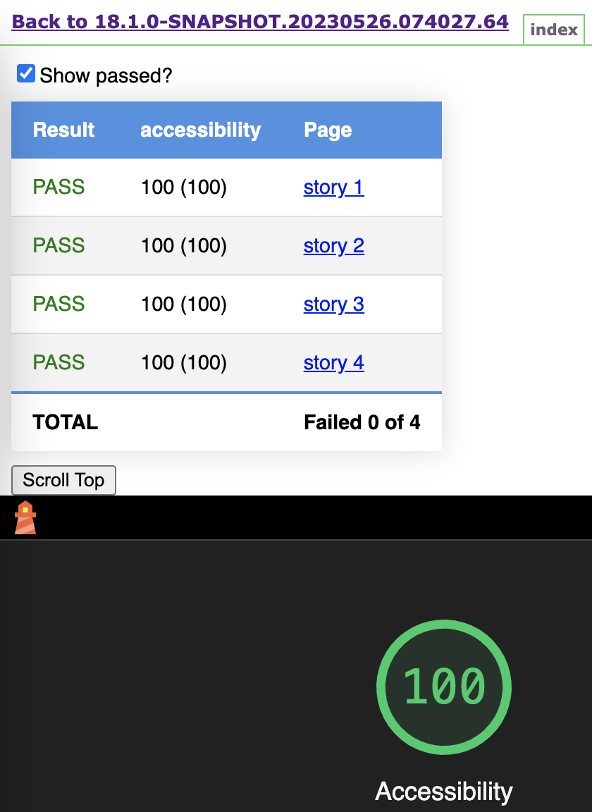
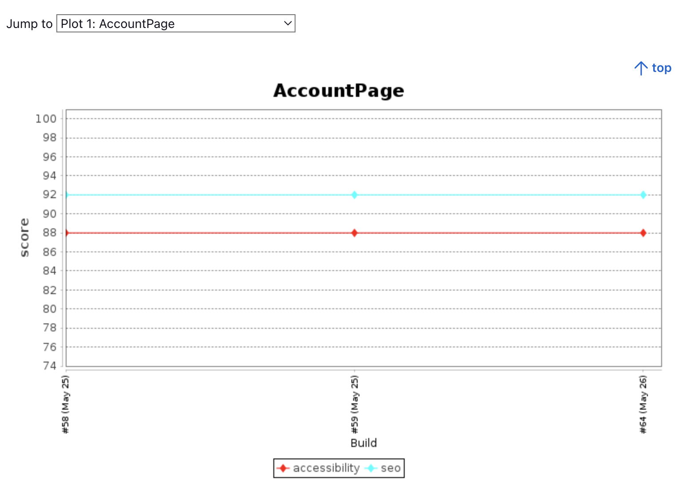

# lighthouse-reporting

> Generate Lighthouse reports in HTML, CSV, and JSON formats, optimized for publishing in Jenkins or GitHub Actions.

The reports include trend history support, allowing you to track performance improvements over time.

<p align="center">
  
&nbsp; &nbsp; &nbsp; &nbsp;
  
</p>

## Usage

Examples of usage with Playwright + Lighthouse (and Storybook).

`npm i -D lighthouse playwright-lighthouse lighthouse-reporting`

### In your frontend or testing framework
The example of usage [playwright](https://github.com/microsoft/playwright) and [playwright-lighthouse](https://github.com/abhinaba-ghosh/playwright-lighthouse) together.

<details>
  <summary>lighthouse_pages.spec</summary>

```ts
import path from 'path'
import { playAudit } from 'playwright-lighthouse'
import { playwrightLighthouseTest, getScores, writeCsvResult, writeHtmlListEntryWithRetry, LighthouseResult } from 'lighthouse-reporting'
import { MyPage1 } from '../../pages/my-page-1.page.js'
import { MyPage2 } from '../../pages/my-page-1.page.js'

playwrightLighthouseTest.setTimeout(60000)
const reportDir = path.join(process.cwd(), 'lighthouse')
const htmlFilePath = path.join(reportDir, 'index.html')

const swimlanes = ['performance']
const lighthousePages = [
    { name: 'MyPage1', po: MyPage1, thresholds: { performance: 80, accessibility: 88, seo: 92 }, swimlanes },
    { name: 'MyPage2', po: MyPage2, thresholds: { performance: 90, accessibility: 100, seo: 90 }, swimlanes },
]

lighthousePages.forEach(({ name, po, thresholds, swimlanes }) => {
    playwrightLighthouseTest(name, async ({ context, port, baseURL }) => {
        const onlyCategories = ['accessibility', 'seo', 'performance']

        // make sure to acess context or page at least once
        // to let playwright initialize context!
        context // this is enough to make the test work

        // note: importing LighthouseResult is not needed since playwright-lighthouse@3.2.6
        const result: LighthouseResult = await playAudit({
            url: baseURL + po.getPath('123'),
            port,
            thresholds,
            reports: {
                formats: {
                    html: true,
                },
                name,
                directory: reportDir,
            },
            opts: {
                onlyCategories,
                screenEmulation: { disabled: true },
            },
            disableLogs: true,
            ignoreError: true,
        })

        const scores = getScores(result)
        await writeCsvResult(reportDir, name, scores, thresholds, swimlanes)
        await writeHtmlListEntryWithRetry(htmlFilePath, name, scores, thresholds, result.comparisonError)

        if (result.comparisonError) {
            throw new Error(result.comparisonError)
        }
    })
})
```

</details>

### Or in Storybook

An example for storybook with lighthouse and screenshot testing

<details>
  <summary>storybook.spec.ts</summary>

```ts
import path from 'path'
import { BrowserContext } from '@playwright/test'
import { playAudit } from 'playwright-lighthouse'
import {
    playwrightLighthouseTest,
    getScores,
    writeCsvResult,
    writeHtmlListEntryWithRetry,
    LighthouseResult,
    StorybookIndexStory,
    storybookPlaywright,
    writeScoresToJson
} from 'lighthouse-reporting'

playwrightLighthouseTest.setTimeout(60000)
const lhScoresDir = path.join(process.cwd(), process.env.LH_SCORES_DIR || 'lh-scores')
const csvReportDir = path.join(process.cwd(), process.env.LH_CSV_REPORT_DIR || 'lighthouse')
const htmlReportDir = path.join(process.cwd(), process.env.LH_REPORT_DIR || 'lighthouse')
const htmlFilePath = path.join(htmlReportDir, 'index.html')

// use stories.json instead of index.json for storybook v6
// make sure to set buildStoriesJson to true in storybook main.js feature section
const stories = storybookPlaywright.getStories('./storybook-static/index.json', (story) => {
    // skip docs, etc
    if (story.type !== 'story') {
        return false
    }
    // only include stories with test tag
    if (!story.tags.includes('test')) {
        return false
    }
    return true
})

stories.forEach((story) => {
    playwrightLighthouseTest(`${story.title} - ${story.name}`, async ({ context, port, baseURL }) => {
        await runLighthouse(story, context, port, baseURL)
        await storybookPlaywright.captureScreenshot(story, context)
    })
})

const runLighthouse = async (story: StorybookIndexStory, context: BrowserContext, port: number, baseURL?: string) => {
    const onlyCategories = ['accessibility']
    const thresholds = { accessibility: 100 }
    const name = story.id

    // make sure to acess context or page at least once
    // to let playwright initialize context!
    context // this is enough to make the test work
    // or manually open the page
    // const page = context.pages()[0]
    // await page.goto(`/iframe.html?id=${story.id}`)

    // note: importing LighthouseResult is not needed since playwright-lighthouse@3.2.6
    const result: LighthouseResult = await playAudit({
        url: baseURL + `/iframe.html?id=${story.id}`,
        // page, // alternatevely, path the page instead of the `url`
        port,
        thresholds,
        reports: {
            formats: {
                html: true,
            },
            name,
            directory: htmlReportDir,
        },
        opts: {
            onlyCategories,
            screenEmulation: { disabled: true },
        },
        disableLogs: true,
        ignoreError: true,
    })

    const scores = getScores(result)
    await writeCsvResult(csvReportDir, name, scores, thresholds)
    await writeHtmlListEntryWithRetry(htmlFilePath, name, scores, thresholds, result.comparisonError)
    // write score results in JSON, allows generating the Average csv report
    await writeScoresToJson(lhScoresDir, name, scores, result)
}
```

</details>

### Configs examples

<details>
  <summary>playwright.storybook.config.ts</summary>

```ts
import { PlaywrightTestConfig } from '@playwright/test'

const baseURL = 'http://127.0.0.1:6009'
// process.env.LH_REPORT_DIR = 'lighthouse-html' // adjust lighthouse output folder if required
// process.env.LH_CSV_REPORT_DIR = 'lighthouse-csv' // adjust lighthouse csv report folder if required
// process.env.LH_SCORES_DIR = 'lh-scores' // to write and store scores in json format or write average report


const config: PlaywrightTestConfig = {
    use: {
        viewport: { width: 1280, height: 820 },
        ignoreHTTPSErrors: true,
        acceptDownloads: false,
        trace: 'off',
        baseURL,
        screenshot: { mode: 'off' },
    },
    projects: [
        {
            name: 'chromium',
            use: {
                browserName: 'chromium',
                launchOptions: { args: ['--disable-gpu'] },
            },
            retries: 0,
        },
    ],
    expect: { toMatchSnapshot: { threshold: 0.2 } },
    reporter: 'line',
    testDir: 'test/storybook',
    testMatch: '*.spec.ts',
    fullyParallel: true,
    globalSetup: './src/global-setup.ts',
    globalTeardown: './src/global-teardown.ts',
    forbidOnly: true,
    webServer: [
        {
            command: 'npx http-server ./storybook-static --port 6009 --silent',
            url: `${baseURL}/index.json`,
            timeout: 15 * 1000,
            reuseExistingServer: false,
            ignoreHTTPSErrors: true,
        },
    ],
}
export default config
```

</details>

<details>
  <summary>global-setup.ts</summary>

```ts
import path from 'path'
import fs from 'fs/promises'
import { lighthouseSetup } from 'lighthouse-reporting'

const lhScoresDir = path.join(process.cwd(), process.env.LH_SCORES_DIR || 'lh-scores')
const csvReportDir = path.join(process.cwd(), process.env.LH_CSV_REPORT_DIR || 'lighthouse')

async function globalSetup() {
    await fs.mkdir(lhScoresDir, { recursive: true })
    await fs.mkdir(csvReportDir, { recursive: true })
    await lighthouseSetup()
}

export default globalSetup
```

</details>

<details>
  <summary>global-teardown.ts</summary>

```ts
import path from 'path'
import { lighthousePlaywrightTeardown, buildAverageCsv } from 'lighthouse-reporting'

const lhScoresDir = path.join(process.cwd(), process.env.LH_SCORES_DIR || 'lh-scores')
const csvReportDir = path.join(process.cwd(), process.env.LH_CSV_REPORT_DIR || 'lighthouse')

async function globalTeardown() {
    await lighthousePlaywrightTeardown()
    await buildAverageCsv(lhScoresDir, csvReportDir)
}

export default globalTeardown
```

</details>

## Jenkins

Plugins used [HTML Publisher](https://plugins.jenkins.io/htmlpublisher/) and [Plot](https://plugins.jenkins.io/plot/).

<details>
  <summary>Jenkinsfile</summary>

```
stage('Lighthouse') {
    steps {
        # run playwright-lighthouse tests
    }

    post {
        always {
            # html report per build
            publishHTML(target: [
                reportName           : 'Lighthouse',
                reportDir            : "$WORKSPACE/lighthouse",
                reportFiles          : 'index.html',
                keepAll              : true,
                alwaysLinkToLastBuild: true,
                allowMissing         : false
            ])

            # csv trend history report
            script {
                csvFiles = findFiles(glob: 'lighthouse/*.csv')
                for (csvFile in csvFiles) {
                    filePath = "${csvFile}"
                    plot(csvFileName: filePath.substring(filePath.lastIndexOf("/") + 1),
                        csvSeries: [[displayTableFlag: false, exclusionValues: '', file: filePath, inclusionFlag: 'OFF', url: '']],
                        exclZero: true,
                        group: 'my app',
                        numBuilds: '100',
                        style: 'line',
                        title: filePath.substring(filePath.lastIndexOf("/") + 1, filePath.indexOf(".")),
                        yaxis: 'score',
                        yaxisMaximum: '101',
                        yaxisMinimum: '15') # adjust scale
                }
            }
        }
    }
}
```

</details>

## GitHub Actions

TODO
